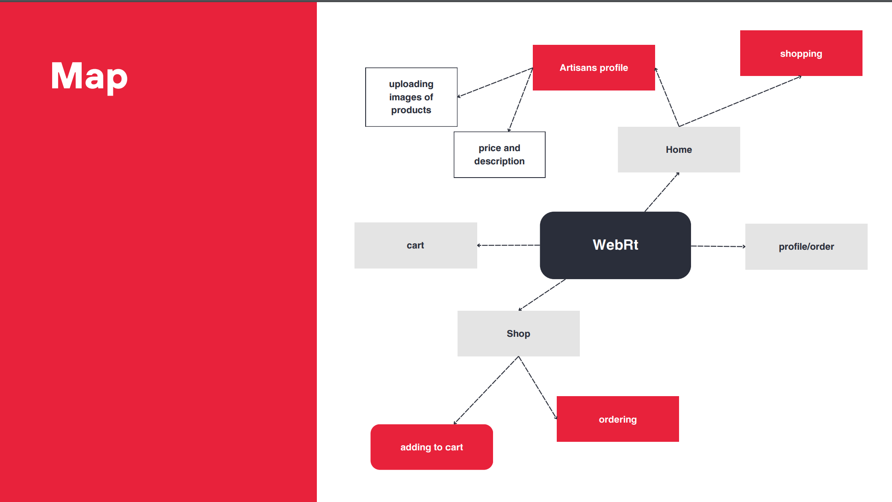

# Online Market Place for Local Artisans

Welcome to our Local Artisan Marketplace repository! This project aims to provide a platform for local artisans to showcase and sell their products to buyers in the community. It features an authentication system for both buyers and sellers, product pages for ordering, and shipment tracking with unique IDs.

## Video Demo

[](https://youtu.be/H-bIrMqSrbw?si=mmqPmJaU_3hOX_9i)


## Features

- Authentication System: Buyers and sellers can register and log in securely.
- Buyers Page: Buyers can browse products, place orders, and track shipments.
- Sellers Page: Artisans can manage their products, view orders, and update shipment statuses.
- Order Tracking: Each order comes with a unique shipment ID for tracking.
- Responsive Design: The platform is built with a responsive design, ensuring a seamless user experience across various devices, including desktops, tablets, and smartphones.

## Why Choose Local Artisan Marketplace?

- Support Local Artisans: By purchasing from the Local Artisan Marketplace, buyers directly support local artisans and small businesses in their community, contributing to the growth of the local economy.

- Unique Handcrafted Products: The platform offers a curated selection of handcrafted products that are not mass-produced. Each item is unique and reflects the artisan's creativity and craftsmanship.

- Personalized Shopping Experience: Buyers can discover one-of-a-kind products tailored to their preferences and tastes. They can interact with artisans, learn about their creative process, and even request custom orders.

- Convenient and Secure Transactions: The platform provides a secure and user-friendly shopping experience, with multiple payment options available for buyers. All transactions are encrypted and processed securely to protect users' sensitive information.
## Tech Stack

**Client:** React, Redux, TailwindCSS

**Server:** Node, Express ,Appwrite


## Screenshots




## Run Locally

Clone the project

```bash
  git clone https://github.com/smartcraze/CN080
```

Go to the project directory

```bash
  cd cn-080
```

Install dependencies

```bash
  npm install
```

Start the server

```bash
  npm run dev
```


## Authors

- [@Parna324](https://github.com/Parna324)
- [@z4heed](https://github.com/z4heed)

## 🔗 Links

[](https://www.linkedin.com/in/surajv354/)


